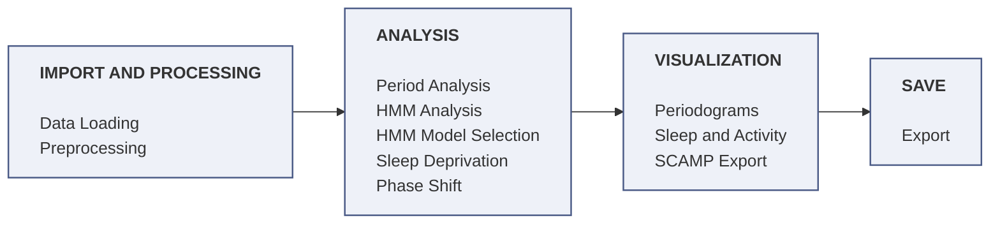

# ClockWork

**A Streamlit application for analysing *Drosophila* Activity Monitor (DAM) data.**

ClockWork takes raw Trikinetics `MonitorXXX.txt` files through a complete
workflow: import and validation, dead-fly curation, LD/DD splitting, circadian
period estimation by four independent algorithms, sleep quantification, Hidden
Markov Model sleep-state classification, light-pulse phase-shift measurement,
sleep-deprivation rebound analysis, and export — including back into the legacy
SCAMP MATLAB format.

Everything lives in one `xarray` Dataset backed by NetCDF, so you can save at
any point and reload without recomputing.

---

## Contents

- [Installation](#installation)
- [Running the app](#running-the-app)
- [Quick start](#quick-start)
  - [Try it on the example data](#try-it-on-the-example-data)
- [The metadata file](#the-metadata-file)
  - [Column reference](#column-reference)
  - [Which columns each analysis needs](#which-columns-each-analysis-needs)
  - [Format rules](#format-rules)
- [The modules](#the-modules)
  - [Data Loading](#data-loading)
  - [Preprocessing](#preprocessing)
  - [Period Analysis](#period-analysis)
  - [Periodograms](#periodograms)
  - [Sleep and Activity](#sleep-and-activity)
  - [HMM Analysis](#hmm-analysis)
  - [HMM Model Selection](#hmm-model-selection)
  - [Sleep Deprivation](#sleep-deprivation)
  - [Phase Shift](#phase-shift)
  - [SCAMP Export](#scamp-export)
  - [Export](#export)
- [How the algorithms work](#how-the-algorithms-work)
  - [Lomb-Scargle periodogram](#lomb-scargle-periodogram)
  - [Autocorrelation rhythmicity index](#autocorrelation-rhythmicity-index)
  - [Continuous wavelet transform](#continuous-wavelet-transform-cwt)
  - [MESA](#mesa--maximum-entropy-spectral-analysis)
  - [Rhythmic / arrhythmic classification](#rhythmic--arrhythmic-classification)
  - [Sleep detection](#sleep-detection)
  - [Hidden Markov sleep states](#hidden-markov-sleep-states)
  - [Phase-shift measurement](#phase-shift-measurement)
  - [Sleep deprivation and rebound](#sleep-deprivation-and-rebound)
  - [Preprocessing pipeline](#preprocessing-pipeline)
  - [Gap handling](#gap-handling)
- [Thresholds and defaults](#thresholds-and-defaults)
- [Data model](#data-model)
- [References](#references)

---

## Installation

ClockWork needs **Python 3.10 or later**; 3.11 is what it's developed and tested
on, and what the instructions below create.

### 1. Create and activate the environment

```bash
conda create -n clockwork python=3.11
```

```bash
conda activate clockwork
```

### 2. Install the dependencies

From the repository root (the folder containing `requirements.txt`):

```bash
pip install -r requirements.txt
```

Four packages are **version-pinned on purpose** — `numpy`, `scipy`, `astropy`
and `PyWavelets`. Their default behaviour is baked into the numbers ClockWork
reports, so upgrading them can silently shift results. Don't bump them casually.

### 3. Optional — GPU acceleration

Two things run much faster on an NVIDIA GPU: the continuous wavelet transform
and the zero-inflated-Poisson HMM likelihood. Both fall back to CPU
automatically, so this step is optional.

```bash
pip install torch ptwt
```

Pick the CUDA build matching your system at
<https://pytorch.org/get-started/locally/>. On CPU the CWT is *slow* — if you
plan to use it on a full cohort, the GPU is strongly recommended. Set
`HMM_USE_GPU=0` in the environment to force the HMM back to CPU.

---

## Running the app

From the repository root:

```bash
streamlit run app/ClockWork.py
```

The app opens in your browser at `http://localhost:8501`. If that port is
taken, append `--server.port 8502`.

---

## Quick start

1. Put your `MonitorXXX.txt` files in one folder.
2. Build a metadata file next to them — start from `metadata_template.csv` and
   read [The metadata file](#the-metadata-file) first.
3. **Data Loading** → *Fresh Start* → point at both → **Load & Validate Data** →
   **Create Dataset**. Choose which metadata columns define your comparison
   groups.
4. **Preprocessing** → curate dead flies → apply the LD/DD split.
5. **Sleep and Activity** → run sleep analysis at the top of the page. Every
   sleep-dependent page downstream (**HMM Analysis**, **Sleep Deprivation**,
   **Export**) reads the result from here.
6. Then whichever analysis you need: **Period Analysis** for circadian period,
   **Sleep and Activity** for sleep/activity profiles, **HMM Analysis** for
   sleep-state structure, **Phase Shift** for light-pulse experiments.
7. **Export** → save the dataset as `.nc` so you never have to recompute.

> **Watch the terminal on first load.** Some validation problems — most
> importantly a monitor being dropped because its dates fall outside the data
> file's range — are reported to the terminal but *not* to the browser. See
> [Format rules](#format-rules).

### Try it on the example data

`example_data/` holds a complete six-monitor experiment (192 flies, six
genotypes) with its `metadata.xlsx`. Point Data Loading at that folder to see
the whole workflow run end to end.

**You do not need to pre-trim your recordings.** The example files deliberately
carry about a week of extra recording before the window the metadata asks for,
and everything the monitor kept recording after it. ClockWork reads whatever
range `start_datetime` and `stop_datetime` describe and ignores the rest, so you
can point it straight at the raw file your monitor wrote.

---

## The metadata file

A CSV or Excel file (`.csv`, `.xlsx`, `.xls`) with **one row per monitor**, or
one row per monitor-and-channel-range if you use `region_id`. It tells ClockWork
which files to read, what window to analyse, when lights came on, and how to
group the flies.

`metadata_template.csv` in the repository root is a ready-to-edit starting point.

### Column reference

| Column | Required | Example | Meaning |
|---|---|---|---|
| `Monitor` | **Yes** | `17` | Matches `Monitor17.txt`. **Capital M.** |
| `start_datetime` | **Yes** | `2025-01-15 09:00:00` | **Must be ZT0 (lights-on).** Defines each fly's time origin, the phase of all ZT binning, and the date prefix of its ID. |
| `stop_datetime` | **Yes** | `2025-01-27 09:00:00` | End of the window to analyse. Must fall inside the data file's range — see [Format rules](#format-rules). |
| `genotype` | **Yes** | `w1118` | Attached to every fly. The default group label. |
| `first_DD_day` | For DD/LD work | `2025-01-18 09:00:00` | **CT0 (subjective morning) of the first full DD day** — not the last lights-off. Without it there is no LD/DD split and period analysis silently runs on the combined record. |
| `region_id` | Situational | `1-16`, `5`, `1,3,5`, `65-96` | Which channels this row covers. Blank → channels **1–32 only**. Required on non-DAM monitor sources (e.g. FlyBox) — see [Format rules](#format-rules). |
| `pulse_time` | Phase Shift only | `ZT15` | Light-pulse time as a ZT hour. Accepts `ZT15`, `zt15`, `ZT 15`, `15`, `15.5`. Leave **blank** for unpulsed controls (blank means "no pulse"; `0` would mean ZT0). |
| `pulse_duration_min` | Optional | `60` | Pulse length. The pulse window is NaN-masked so the acute startle isn't mistaken for a phase marker. |
| `condition` | Recommended | `ZT15_60min` | Default second grouping key for phase-shift comparisons. |
| `temperature` | Optional | `25C` | Historically the second half of the default group label. |
| `sex`, `treatment`, `incubator`, `notes`, … | Optional | `M` | **Any column you invent** becomes a per-fly coordinate and an eligible grouping factor. |

Do **not** add an `id` column — ClockWork computes it as
`YYYYMMDD_Monitor_Region` (e.g. `20250115_17_5`).

Columns excluded from grouping: `file`, `region_id`, `Monitor`, `id`,
`start_datetime`, `stop_datetime`, `first_DD_day`, and any datetime-typed
column. Everything else is offered in the **"Group-defining metadata columns"**
selector at import, and can be re-grouped later without re-importing.

### Which columns each analysis needs

| Analysis | Needs |
|---|---|
| Loading and validation | `Monitor`, `start_datetime`, `stop_datetime` |
| Creating the dataset | the above **plus** `genotype` |
| Period analysis (DD) | `first_DD_day` — without it the split doesn't exist and LD+DD get analysed together |
| Sleep / activity (LD) | `first_DD_day`, and `start_datetime` set to ZT0 |
| Phase shift | `pulse_time` (**hard requirement**, the module stops without it) + `first_DD_day`; `pulse_duration_min` and `condition` recommended |
| Sleep deprivation | `first_DD_day` (LD-only analysis). The SD day, start ZT and duration are entered in the UI, not the metadata |
| SCAMP export | nothing extra; monitor and region are recovered from the fly ID |
| Grouping / faceting only | `temperature`, `sex`, `condition`, `notes`, or anything else you add |

### Format rules

**Match the example metadata file exactly.** Required column names are
case-sensitive and are never corrected — `Monitor` takes a capital M,
`first_DD_day` takes capital DD, and the rest are lowercase. Every required
cell must be filled; a blank in a required column invalidates the rows that
depend on it. Write dates in ISO format (`2025-01-15 09:00:00`); other formats
are read US-style, so `3/4/25` means March 4, not April 3.

Beyond formatting, five rules govern whether your data loads correctly.

1. **`stop_datetime` must fall inside the data file's date range.** If it
   doesn't, that monitor is dropped from the analysis and the app still reports
   a successful load — you will only see a reduced fly count. The rule applies
   per `(Monitor, start_datetime)` pair using the latest stop date among rows
   sharing that pair, so one wrong stop date removes every region row for that
   monitor. Check your fly count after loading, and check the terminal, where
   the dropped monitors are listed.

2. **`genotype` is required.** Dataset creation fails without it.

3. **On non-DAM monitor sources (e.g. FlyBox), `region_id` is required.**
   Region parsing defaults to 32 channels, so a blank `region_id` on a file with
   more channels keeps only channels 1–32 and discards the rest without warning.
   Write explicit ranges covering the full channel count (1–96 on a FlyBox). The
   channel count is auto-detected from the data file; nothing in the metadata
   declares it. Note that `metadata_template.csv` has no `region_id` column —
   add one.

4. **`region_id` ranges must not exceed the channels in the data file.**
   Requesting channels the file does not contain stops dataset creation. This is
   what happens if you point non-DAM channel ranges (e.g. FlyBox's 1–96) at a
   32-channel DAM file, or the reverse.

5. **A fly whose `first_DD_day` equals its `start_datetime` has no LD epoch**
   and will be absent from every LD analysis. Set `first_DD_day` to CT0 of the
   first full DD day if you need that fly in LD results.

---

## The modules

The modules fall into four sections. The descriptions below follow the order the
sidebar lists them in.



**Import and processing** builds the dataset every other module reads, so run
these two first. **Analysis** modules write results onto that dataset; they are
independent of one another, so run only the ones you need. **Visualization**
reads results back out as figures and tables. **Save** writes the whole dataset
to disk, capturing whatever you have completed.

Two modules pair with another. **Model Selection** cross-validates to pick a
state count and emission model, which you then enter in **HMM Analysis**; it
passes no data, only the parameter choice, so skip it if you already know your
settings. **Periodograms** displays what **Period Analysis** computed, and stays
empty until that module has run.

### Data Loading

Three tabs. **Fresh Start** imports raw `MonitorXXX.txt` files plus a metadata
file, validates the dates against each file's actual range, and builds the
dataset. **Load NetCDF** reopens a previously saved `.nc`, restoring every
completed analysis. **Combine Datasets** concatenates several `.nc` files into
one, disambiguating duplicate fly IDs.

This is also where you choose which metadata columns define your comparison
groups. A reversible group filter is also available here: filtering retains the
full dataset and clears every downstream cache, so subsetting can be undone.

**Produces:** the master dataset. **Every other module depends on this one.**

### Preprocessing

Three sequential steps.

**Curate dead animals** — flags flies whose activity ceases, using a rolling
window and an immobility threshold, and trims each fly's record at its death.
Controls: minimum days alive, rolling window (hours), immobility proportion.

**Apply the LD/DD split** — uses `first_DD_day` to divide each fly's record into
the entrained (LD) and free-running (DD) epochs. Optionally discards the first
DD day, which is a transition day. An activity heatmap is provided here for
inspecting the result.

**Sleep analysis** — applies the 5-minute immobility rule and classifies each
bout as short, intermediate or long.

**Produces:** `is_alive`, the LD and DD partitions, `sleep` and the per-state
sleep masks, and a per-bout table.

### Period Analysis

The core circadian engine. Runs up to four
independent period estimators — [CWT](#continuous-wavelet-transform-cwt),
[Lomb-Scargle](#lomb-scargle-periodogram),
[Autocorrelation](#autocorrelation-rhythmicity-index) and [MESA](#mesa--maximum-entropy-spectral-analysis) —
each with its own advanced-parameter expander and a plain-language explanation
of the method.

Three shared controls sit at the top and govern all four methods:

- **Period search range** (default 16–36 h) — one knob that drives both the
  search and the classification window, so they can't drift apart.
- **Minimum DD days** (default 4) — a *flag*, not a filter; short records are
  surfaced with their length rather than dropped.
- **Max gap to bridge** (default 60 min) — see [Gap handling](#gap-handling).

Below the runners: a per-fly summary table; an **interactive threshold
explorer** that shows live which flies would be called rhythmic as you drag each
algorithm's cutoff; and the **rhythmicity classification** section.
**Autocorrelation is the canonical classifier** — its call is what gates
downstream group filtering. The LS and CWT classifiers are diagnostic.

Defaults to the DD partition when a split exists, which is the correct epoch
for free-running period.

### Periodograms

A read-only companion to Period Analysis. Shows group-averaged spectra (mean ± SEM) for
whichever methods you've run — one panel per method, each on its own y-axis
because the strength metrics are **not comparable across methods**. Run
Period Analysis first; this module only displays what that one stored.

### Sleep and Activity

The main descriptive-plots module. Daily activity profile, daily sleep profile,
per-fly sleep bout duration curves (log-duration KDE or survival/CCDF, mean ±
SEM per group with a group-comparison significance test), sleep-state totals
(short / intermediate / long, as percentage or absolute), and day/night
activity and sleep summaries — using subjective time bins when the data is DD.
A ZT bin-size slider and a group filter apply throughout. Every chart has a
matching group-level and per-fly CSV export.

### HMM Analysis

Fits a Hidden Markov Model of sleep state to the activity data. Choose the
phase (LD, DD, both together, or both fitted separately) and one of three
presets — see [Hidden Markov sleep states](#hidden-markov-sleep-states) for what
each one is and when to pick it. The advanced expander exposes state count,
training scope, emission model, transition constraints, restarts and decoding
method.

Outputs: state occupancy summary, hypnogram heatmap, occupancy by group, group
time-course across ZT, and state fractions by time of day.

**Run HMM Model Selection first** to choose a state count and emission model.

### HMM Model Selection

k-fold cross-validation to pick the HMM's parameters *before* committing to a
full run. Produces held-out log-likelihood (read the elbow), AIC and BIC per
emission model, and an agreement-with-threshold-sleep percentage.

Log-likelihood, AIC and BIC are only comparable **within one emission model**,
because Poisson, Bernoulli and Gaussian likelihoods live on different scales. To
compare *across* emission models, use the agreement percentage.

### Sleep Deprivation

Compares baseline sleep against post-deprivation recovery. Requires sleep
analysis and an LD epoch. An interactive preview trace across all days helps
you identify the SD window, which you then enter as day index, start ZT and
duration.

Three result tabs: ZT time-courses (baseline vs recovery, the difference, and
the cumulative difference), bar graphs (light/dark totals and rebound
percentage), and CSV export.

Note the scope: this is a **descriptive within-cohort readout** with no
undisturbed-control arm and no significance test. It describes an observed
change; it does not test a hypothesis.

### Phase Shift

Measures each fly's phase shift after a light pulse. Requires `pulse_time` in
the metadata.

Two reference modes: against an **unpulsed control group** (per-day group-average
peak matching, following the lab's `peakphaseplot.m`), or against **each fly's
own pre-pulse rhythm** (per-fly regression extrapolated across the pulse, which
needs several pre-pulse days).

Two marker methods: **peak matching** (the default — median error ~1 min on the
validation cohort) or **onset regression** (Aschoff / Daan-Pittendrigh style —
noisier, median ~3 min but a long tail; check the actogram before trusting it).

A single-fly preview actogram lets you check marker detection before running the
cohort. Results include a per-group box plot, a breakdown of *why*
any flies abstained, per-fly double-plotted actograms with the fitted pre- and
post-pulse lines overlaid, and CSV exports including the exact parameters used.

### SCAMP Export

Writes curated, LD/DD-split data into the legacy SCAMP MATLAB toolbox format so
existing lab analyses keep working on ClockWork-cleaned data. Requires the LD/DD
split. You set the output directory, filename prefix, lights-on military time,
per-phase minimum-day thresholds, and which sampling intervals to write (1-min
and/or 30-min). Reports a per-board manifest and lists any dropped flies.

There is also a standalone CLI — see
[`scamp_export/README.md`](scamp_export/README.md).

### Export

Saves the dataset to NetCDF (optionally the LD and DD partitions as separate
files too), plus CSV exports: raw activity, ZT-binned group averages in
GraphPad-friendly Mean/SD/N layout, a matching per-fly long-format file, the
period summary (optionally filtered to rhythmic flies only), sleep bouts, and —
if you've run it — HMM state assignments and ZT-binned state fractions.

---

## How the algorithms work

### Lomb-Scargle periodogram

For each candidate period, Lomb-Scargle asks how much of the record's variance a
sinusoid at that period explains. Unlike an FFT it doesn't need evenly spaced
samples, so it consumes every finite minute directly and gaps are simply absent
timestamps — which is why LS is the one method here that never routes through
gap bridging (re-gridding would inject low-frequency bias).

ClockWork uses the *generalized* form: a floating offset is fitted at each trial
frequency, which is more robust to gaps and weak rhythms than the classical
formulation. Power is reported R²-style in [0, 1] — the fraction of variance the
best period explains — which is LS's native rhythm-strength index. The
periodogram peak gives the period; its height gives the strength.

A false-alarm probability is computed at the peak using the Baluev bound, but
**FAP is reported, not used as a gate**: on a long dense record FAP fires on
weak-but-consistent periodicity and over-called arrhythmic flies,
whereas power separated the phenotypes by an order of magnitude.

Built on `astropy.timeseries.LombScargle`. CPU, parallelised across flies.

> Lomb 1976; Scargle 1982; Zechmeister & Kürster 2009 (generalized form);
> Baluev 2008 (FAP bound); VanderPlas 2018 (astropy implementation);
> Horne & Baliunas 1986 and Refinetti 2007 for the FAP < 0.05 convention.

### Autocorrelation rhythmicity index

Correlate the record with time-shifted copies of itself: a rhythmic fly
resembles itself again one cycle later, so peaks appear at multiples of the
period. ClockWork extracts the longest continuous block, mean-centres it,
computes the full Pearson autocorrelation and normalises by the zero-lag value
so every lag reads as *r* ∈ [−1, 1].

It then searches for the tallest prominent peak in a lag window following
SCAMP's **second-day-peak convention**: with `ac_peak = 2` the search covers
lags of roughly 40–56 h and the reported period is peak lag ÷ 2, so a genuine
24 h rhythm reads ~24 regardless of which harmonic was strongest. **The height
of that peak is the Rhythmicity Index**, and the classifier gates on it.

Two guards matter. If no prominent peak exists — a flat autocorrelation, i.e. an
arrhythmic fly — the window maximum is used rather than returning NaN, so
arrhythmic flies stay in the denominator instead of silently vanishing. And a
**long-period anti-halving guard** checks the sign of the autocorrelation at the
implied fundamental lag: if it's negative, the selected lag *is* the
fundamental (a genuine ~43 h rhythm) and the ÷2 is skipped. The test is
sign-based with no magic number, and leaves ordinary ~24 h results bit-identical.

Built on `scipy.signal`. CPU, parallelised.

> Levine et al. 2002 (the Rhythmicity Index); SCAMP `rindex_raw.m` / `autoco.m`
> (Vecsey et al. 2024); Meireles-Filho et al. 2018.

### Continuous wavelet transform (CWT)

A wavelet transform slides a wave-shaped template (a complex Morlet) of many
different widths across the record, producing a 2-D power surface of period ×
time. Unlike LS or autocorrelation, it can show a period **changing over the
recording**. The period grid is logarithmic at 32 voices per octave (~0.5 h
resolution near 24 h), and a cone of influence (COI) marks where edge effects
contaminate the estimate.

That 2-D surface then has to be reduced to one period and one strength per fly,
and *how* is the main knob:

- **`global_rednoise` (default)** — build the COI-excluded global wavelet
  spectrum, find its peak, and divide by the **AR(1) red-noise expected power at
  that same period**. In plain terms: measure the peak against the modelled
  noise floor directly underneath it. An arrhythmic red-noise ramp rising toward
  the long-period edge is exactly what AR(1) predicts there, so it scores ~1 and
  is rejected — even on a wide search range — while a genuine localised bump
  scores several-fold higher.
- **`ar1`** — the classic Torrence & Compo significance test (power ÷ the 95%
  AR(1) threshold; > 1 means significant at α = 0.05). Faithful to the paper,
  but **length-sensitive**: its threshold shrinks with record length, so it
  over-calls long records. This was the previous default.
- **`global`** — peak ÷ mean band power. Length-stable but not range-robust: on
  a wide band an arrhythmic ramp inflates the mean and the edge pile-up reads as
  a peak (the "band-edge artifact").
- **`global_baseline`**, **`global_neighbor`**, **`ridge`** — alternative
  reductions retained for comparison.

If the entire period band falls inside the COI, strength is returned as **NaN**
rather than a fabricated low value. A warning prints when the requested maximum
period exceeds what the record length can resolve — roughly 2√2 × period of
data, which is why 32 h needs about 3.8 days and lines up with the 4-day floor.

Built on `PyWavelets`, with a **CUDA path via PyTorch + `ptwt`** that is
auto-detected. This is the analysis that most benefits from a GPU.

> Torrence & Compo 1998 (the wavelet framework, AR(1) significance, COI, global
> spectrum); Leise & Harrington 2011 and Leise 2013 (CWT in circadian
> behaviour); Liu et al. 2007 (the unrectified-power scale bias).

### MESA — maximum entropy spectral analysis

MESA fits an autoregressive model to the record and reads the power spectrum off
the AR coefficients, rather than assuming a sum of sinusoids spanning the whole
length. That's why it resolves sharp peaks from short records, and why it
entered chronobiology.

The 1-minute activity is **binned to 30 minutes** before fitting. At 1-minute
sampling a 24 h period spans 1440 samples, and an AR order large enough to span
that is numerically unstable and returns a peak-less monotonic spectrum. Order
defaults to Dowse's N/3 rule.

A second spectrum at a lower (Akaike FPE) order is computed **for display only**,
because the sharp N/3 fit invents spurious low humps on arrhythmic flies that
would pollute group averages.

**MESA has no significance test of its own**, so it owns no rhythmicity
threshold — in the threshold explorer its rhythmic call borrows the
autocorrelation RI and MESA supplies only the period.

Built on `statsmodels`' Burg estimator. CPU, parallelised.

> Burg 1967/1975; Dowse & Ringo 1989; Dowse 2013 (the N/4–N/3 filter-length
> guidance); SCAMP `per_mesa.m`.

### Rhythmic / arrhythmic classification

Three independent classifiers write per-fly boolean flags, and all three apply
the same rule shape: **strength above a threshold AND period inside the search
window**, using one shared window helper so the gating logic can't diverge. A
NaN metric classifies as not-rhythmic — you can't classify without a value. The
thresholds actually used are stamped into the dataset for reproducibility.

**Autocorrelation is the canonical classifier.** Its call is what
`apply_rhythmic_filter` uses to drop arrhythmic flies from group statistics, so
group period estimates aren't biased by what are essentially random period
values. Turn that filter off when loss of rhythmicity *is* the biology you're
measuring.

### Sleep detection

A fly is asleep during any run of consecutive immobile minutes lasting at least
5 minutes — the standard *Drosophila* definition. Short data dropouts (up to 4
minutes) are bridged first, but only when flanked on both sides by the same
valid value, so a dropout can't artificially split one bout into two.

Each qualifying bout is then classified by duration: **short (5–30 min),
intermediate (30–60 min), long (≥ 60 min)**.

Outputs are `int8` with `1 = asleep, 0 = awake, -1 = no measurement`. Sleep
defaults to the **LD** epoch, since the entrained day is the standard reference.

> Shaw et al. 2000 (the 5-minute immobility definition); Abhilash et al. 2026
> (the duration-based state bins).

### Hidden Markov sleep states

Instead of a fixed immobility rule, an HMM treats sleep depth as a small number
of hidden states the fly moves between, and infers both the state sequence and
the transition and emission parameters from the data. The default is **four
states — deep sleep, light sleep, early wake, full wake** — with transitions
restricted to neighbouring states.

Training is by EM with **multiple random restarts** (50 by default), each seeded
differently and perturbed so they explore different basins; the best
log-likelihood wins. Each genotype is fitted independently — no warm-starting
from a control, which would bias experimental groups toward control structure.
States are then sorted so state 0 is always the deepest sleep.

Three presets are available; select one according to the question being asked:

| Preset | Emission | Fitted per | Use it for |
|---|---|---|---|
| **Improved (ZIP)** — default | Zero-inflated Poisson on raw counts | genotype | Activity level. Statistically the best fit to DAM data (zero-inflated integers). |
| **Wiggin 2020** | Binary on moving / not-moving | genotype | Sleep depth and structure; faithful replication. |
| **Harbison 2026** | Gaussian on per-day normalised activity | **fly × day** | Individual differences; faithful replication. |

The **ZIP emission model is novel for DAM data and has not been independently
validated in the literature.** It is a well-motivated choice rather than a
settled standard; compare it against the other two presets by AIC/BIC on your
own data using HMM Model Selection.

Built on `hmmlearn`, with a **CUDA path for the ZIP likelihood** (the
per-iteration hot loop), computed in log-space so tiny probabilities don't
underflow. It's gated to the main process only, because spawned workers
contending for one GPU deadlock.

> Wiggin et al. 2020 PNAS 117(18):10024; Ghosh & Harbison 2026 (bioRxiv
> 2026.01.14.699526); Donelson & Wiggin et al. 2026, *Current Biology*.

### Phase-shift measurement

Both published approaches reduce to the same three steps, so ClockWork
implements one engine and varies only how the daily marker is found:

1. **Find a marker per day** — one clock time per day marking the rhythm's phase.
2. **Regress** marker time against day index, separately before and after the
   pulse. Each fit's slope *is* that epoch's period (~1440 min/day when
   entrained, the endogenous period when free-running).
3. **Compare at the pulse** — extrapolate the pre-pulse line forward and
   subtract. Positive is a delay, negative an advance.

Because step 2 assumes nothing about the slope, the same code handles an
LD-entrained pulse and a DD free-running pulse with no branch. Marker times stay
absolute rather than wrapped to 0–1440, so a free-running rhythm gives a
straight line instead of a sawtooth.

The **peak** method (default) finds the peak of the low-pass-filtered daily
trace. The **onset** method finds the first threshold crossing on a smoothed
envelope, anchored to the end of the day's longest quiet stretch — without that
anchor the earliest crossing on an entrained day is the lights-on startle, not
the activity onset. Its threshold is a multiple of the *whole record's* mean
activity, fixed once per fly, because a window-local level would produce a
systematic pre-versus-post offset — a phase shift the fly never had.

Several safeguards are deliberate: the pulse day itself is excluded from both
fits; the pulse window is NaN-masked; each fit stays within one LD or DD epoch
so it never spans the boundary kink; an implausible fitted period returns a
status rather than a confident wrong answer; the shift is wrapped into
(−period/2, +period/2] because a phase shift is only defined modulo the period;
and a fly with too few usable days abstains explicitly rather than reporting a
two-point regression.

Measured against known shifts injected into real flies: **peak** — median error
~1 min, 90th percentile ~8 min, no abstentions. **Onset** — median ~3 min, but
90th percentile ~170 min and 8/36 abstained. Both are usually accurate; they
differ in the tail, which is why peak is the default.

Results are reported per fly rather than group-averaged, so the output is a
distribution rather than one number per group, and day-to-day marker matching is
automatic rather than manual.

> Levine et al. 2002 BMC Neuroscience 3:1, Fig. 9 (the peak method); the
> Aschoff / Daan-Pittendrigh actogram-onset convention; SCAMP
> `peakphaseplot.m` and `butt_filter.m`.

### Sleep deprivation and rebound

Sleep is binned into ZT bins per fly per day. Each fly's baseline is the mean
across its pre-SD days; recovery days are compared bin by bin. Outputs are the
baseline profile, per-day recovery profiles, the difference, the cumulative
difference (the standard "sleep lost/regained" curve), light and dark phase
totals, and a rebound percentage.

**Scope:** rebound percentage is descriptive — (recovery − baseline) /
baseline — computed on standard 5-minute-rule sleep, within cohort, with no
undisturbed-control arm and no significance test. A *small* standard-sleep
rebound is the expected result.

> Shaw et al. 2002; Abhilash et al. 2026 Fig. 4.

### Preprocessing pipeline

One configuration object applies, in fixed order: **bin → smooth → low-pass →
detrend → normalize**. Every step has an off switch and all defaults are no-ops,
so the default configuration returns the input unchanged.

The critical property is **NaN preservation**: every step gathers a fly's finite
samples into a dense array, transforms them, and scatters them back to their
original positions, so filtering can never treat a missing value as a zero.
Binning skips NaN, and NaN-only bins stay NaN.

Per-method defaults follow their reference implementations: Lomb-Scargle and CWT
get **no preprocessing** beyond mean-centring (the Rethomics / WaveletComp
convention), while autocorrelation gets a 4 h Butterworth low-pass plus linear
detrend (the SCAMP `autoco.m` pipeline). The full configuration is stamped into
the dataset as an audit trail.

### Gap handling

**Zero and NaN mean opposite things and are never conflated.** A `0` is a real
measurement — the fly was watched and didn't move. A `NaN` means no measurement
existed. Filling a gap with zeros would read downstream as sleep and fabricate
behaviour, so gaps stay NaN.

For autocorrelation, CWT and MESA, which need a contiguous series, one knob
governs everything: a gap whose missing span is at or below **Max gap to bridge**
(default 60 min) is bridged by joining the flanking segments and linearly
interpolating the interior; anything larger stays a hard break and the analysis
falls back to the longest clean segment. Setting it to 0 disables bridging.

**Interpolated values are transient and worker-local** — they feed the algorithm
and are never written back to the dataset or the `.nc`. Stored data stays NaN.
Lomb-Scargle never uses this path at all.

---

## Thresholds and defaults

Every user-owned soft threshold is defined **once**, in
[`core/calibrations.py`](core/calibrations.py), with its provenance. Both the
code defaults and the UI controls read from there, so there is no second copy to
drift. These are *calibrations*, not invariants — they're meant to be adjusted.

| Setting | Default | Units | Notes |
|---|---|---|---|
| LS power threshold | `0.006` | R² power | **Provisional.** Sits in the gap between arrhythmic (~0.003) and rhythmic (~0.012) flies on a strong-phenotype cohort; that gap may fill in on marginal data. |
| LS FAP threshold | `0.05` | probability | **Reported, not a gate.** |
| **AC RI threshold** | `0.3` | Rhythmicity Index | The **live per-fly classifier cutoff**. |
| AC group check | `0.3` | RI (group mean) | A group-level sanity criterion, deliberately kept separate from the per-fly cutoff. |
| AC SCAMP reference | `0.195` | RI | SCAMP's historical cutoff. **Reference only, not wired as a default.** Whether 0.3 or 0.195 is the correct per-fly cutoff is unresolved. |
| CWT method | `global_rednoise` | — | Flipped from `ar1`, which over-calls long records. |
| CWT red-noise threshold | `2.0` | ratio to AR(1) floor | Deliberately permissive; ~1 means no excess over the noise floor. |
| CWT AR(1) threshold | `1.0` | ratio to 95% threshold | > 1 ⇔ significant at α = 0.05. |
| CWT global threshold | `1.7` | ratio | **Provisional**; the clusters are not cleanly separable. |
| CWT ridge threshold | `0.30` | fraction of timepoints | Lab choice — no published cutoff exists. Report the value you used. |
| CWT period range | `16`–`36` | hours | **One knob** for search *and* classification. See the tradeoff below. |
| Minimum DD days | `4.0` | days | A **flag, not a filter**. |
| Max gap to bridge | `60` (range 0–120) | minutes | Validated to 60 min; 0 disables bridging. |
| Phase-shift filter | `12.0` | hours | Direct lab precedent from `peakphaseplot.m`. |
| Phase-shift onset threshold | `0.75` | × mean activity | **Provisional**, tuned against injected known shifts. |
| Phase-shift onset smoothing | `180` | minutes | **Provisional**, same sweep. |
| Phase-shift min pre/post days | `3` / `3` | days | Conventional minimum for reading a free-running slope. |
| Phase-shift transient skip | `0` | days | Off by default — how many transient days to discard is protocol-specific. |

**The 36 h CWT ceiling is a stated tradeoff, not a limit.** A genuine long-period
line (~43 h) reads *arrhythmic* at this default. That's the knob working as
intended — widen the range to detect it. The `global_rednoise` metric stays
range-robust when widened, so widening doesn't reintroduce false positives.

Not yet centralised (they live next to their algorithms): the MESA constants,
the CWT voices-per-octave, the autocorrelation peak-picker constants, the
sleep-state duration bins, and every HMM hyperparameter.

---

## Data model

Everything — raw activity, curation flags, sleep masks, period results, HMM
states — lives in **one `xarray.Dataset`** dimensioned `(id, time)`, backed by
NetCDF. Save it in the Export module, reload it in Data Loading, and every
completed analysis comes back with it.

Fly IDs are `YYYYMMDD_Monitor_Region`, e.g. `20250115_17_5`.

Results are stored in the smallest dtype that preserves them — activity counts
as small integers, state flags as `int8`, continuous results as `float32`.
Calculations may upcast internally for numerical safety; what's stored is
downcast.

---

## References

**Period and rhythmicity**

- Lomb, N.R. (1976) Least-squares frequency analysis of unequally spaced data. *Astrophysics and Space Science* 39:447.
- Scargle, J.D. (1982) Studies in astronomical time series analysis II. *Astrophysical Journal* 263:835.
- Horne, J.H. & Baliunas, S.L. (1986) A prescription for period analysis of unevenly sampled time series. *Astrophysical Journal* 302:757.
- Baluev, R.V. (2008) Assessing the statistical significance of periodogram peaks. *MNRAS* 385:1279.
- Zechmeister, M. & Kürster, M. (2009) The generalised Lomb-Scargle periodogram. *A&A* 496:577.
- VanderPlas, J.T. (2018) Understanding the Lomb-Scargle periodogram. *ApJS* 236:16.
- Torrence, C. & Compo, G.P. (1998) A practical guide to wavelet analysis. *Bulletin of the American Meteorological Society* 79:61.
- Liu, Y., Liang, X.S. & Weisberg, R.H. (2007) Rectification of the bias in the wavelet power spectrum. *Journal of Atmospheric and Oceanic Technology* 24:2093.
- Leise, T.L. & Harrington, M.E. (2011) Wavelet-based time series analysis of circadian rhythms. *Journal of Biological Rhythms* 26:454.
- Leise, T.L. (2013) Wavelet analysis of circadian and ultradian behavioral rhythms. *Journal of Circadian Rhythms* 11:5.
- Burg, J.P. (1975) *Maximum Entropy Spectral Analysis.* PhD thesis, Stanford University.
- Dowse, H.B. & Ringo, J.M. (1989) The search for hidden periodicities in biological time series revisited. *Journal of Theoretical Biology* 139:487.
- Dowse, H.B. (2013) Maximum entropy spectral analysis for circadian rhythms. *Journal of Circadian Rhythms* 11:6.
- Levine, J.D., Funes, P., Dowse, H.B. & Hall, J.C. (2002) Signal analysis of behavioral and molecular cycles. *BMC Neuroscience* 3:1.
- Refinetti, R., Cornélissen, G. & Halberg, F. (2007) Procedures for numerical analysis of circadian rhythms. *Biological Rhythm Research* 38:275.
- Meireles-Filho, A.C.A. et al. (2018) Comparative genomics of circadian rhythms. *Behavior Genetics* 48.
- Vecsey, C.G. et al. (2024) SCAMP: sleep and circadian analysis MATLAB program. *Cold Spring Harbor Protocols.*

**Sleep**

- Shaw, P.J., Cirelli, C., Greenspan, R.J. & Tononi, G. (2000) Correlates of sleep and waking in *Drosophila melanogaster*. *Science* 287:1834.
- Shaw, P.J. et al. (2002) Stress response genes protect against lethal effects of sleep deprivation in *Drosophila*. *Nature* 417:287.
- Wiggin, T.D. et al. (2020) Covert sleep-related biological processes are revealed by probabilistic analysis in *Drosophila*. *PNAS* 117(18):10024.
- Donelson, N.C., Wiggin, T.D. et al. (2026) Duration-based sleep states. *Current Biology.*
- Ghosh, A. & Harbison, S.T. (2026) HMM-based sleep scoring in *Drosophila*. *bioRxiv* 2026.01.14.699526.
- Abhilash, L. et al. (2026) *(sleep-state duration bins and circadian gating of ultradian rhythms).*
- Riggle, J. et al. (2022) *(mean-of-matrix scalogram normalisation; Lomb-Scargle over chi-squared).*

**Software**

- `astropy` — Lomb-Scargle · `scipy` / `numpy` — signal processing ·
  `PyWavelets` and `ptwt` — wavelet transforms · `statsmodels` — Burg AR ·
  `hmmlearn` — hidden Markov models · `xarray` / `netCDF4` — the data model ·
  `streamlit` and `plotly` — the interface.
